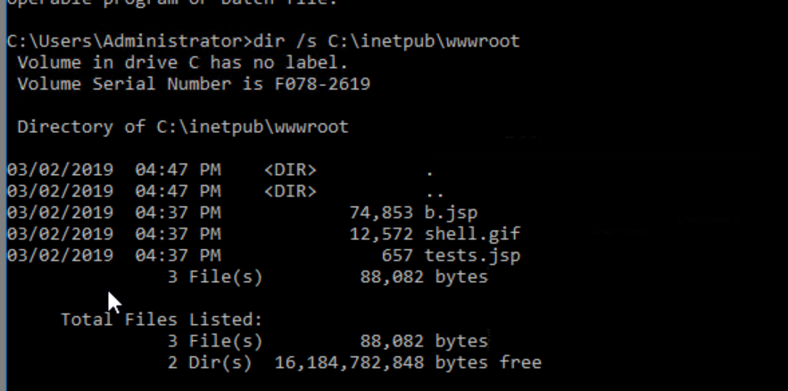
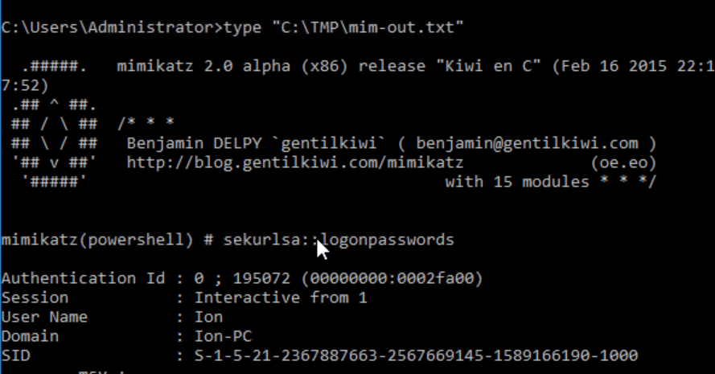
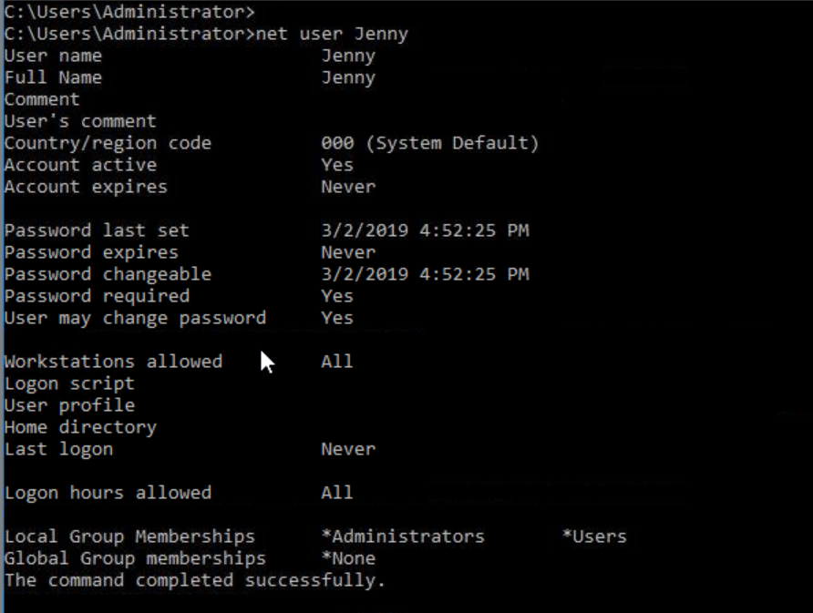
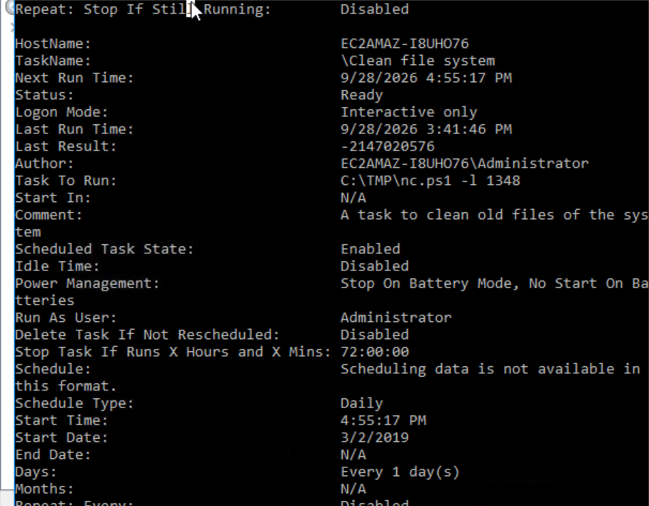
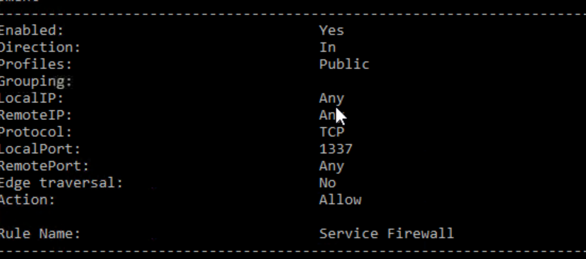
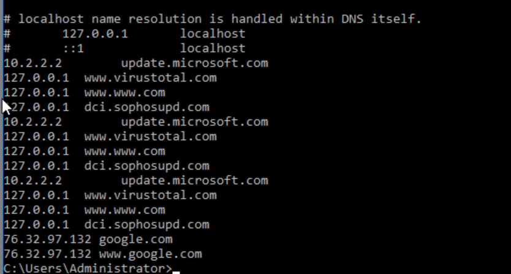

# Incident Summary Report: INVESTIGATING WINDOWS (TRYHACKME)

**Incident ID:** INC-2019-0302  
**Date of Incident:** 03/02/2019  
**Severity:** Critical  
**Status:** Contained / Remediated  
**Lead Investigator:** Eyinade Oluwatomiwa  

---

## 1. Executive Summary
This report documents the forensic artifacts and attack chain uncovered during an endpoint triage investigation of a compromised Windows server (TryHackMe lab environment). On March 2, 2019, an unauthorized external adversary compromised an internal Windows production server hosting Internet Information Services (IIS). The adversary leveraged web shell implants to establish initial footholds, executed credential harvesting tools against memory, modified local host name resolution, established dual persistence via rogue administrative accounts and scheduled jobs, and modified local host firewall rules to permit inbound access. All identified artifacts were isolated, analyzed, and mapped to the MITRE ATT&CK framework.   

---

## 2. Timeline of Events & Evidence (MITRE ATT&CK Mapping)

### Initial Access & Execution (T1505.003 - Server Software Component: Web Shell)
* The threat actor gained initial footholds through IIS web uploads into `C:\inetpub\wwwroot\`.
* Identified staged web shell backdoors (`b.jsp`, `tests.jsp`, `shell.gif`) used to execute arbitrary remote commands on the underlying host.
  
  

### Credential Access (T1003.001 - OS Credential Dumping: LSASS Memory)
* The adversary dropped and executed the credential dumper **Mimikatz** from staging directory `C:\TMP\`.
* The command `sekurlsa::logonpasswords` was executed, outputting dumped plaintext session credentials and NTLM hashes into `C:\TMP\mim-out.txt`.
  
  

### Persistence - Rogue Account (T1136.001 - Create Account: Local Account)
* Staged account persistence by creating a rogue local account named **`Jenny`** assigned directly to the local `*Administrators` group.
* `Last logon: Never` indicates the account was established as a dormant backdoor for redundant privileged access.
  
  

### Persistence - Scheduled Execution (T1053.005 - Scheduled Task/Job: Scheduled Task)
* Staged automated persistence via Windows Task Scheduler under task name **`\Clean file system`**.
* The task was configured to trigger daily starting `3/2/2019`, executing the Netcat reverse shell script `C:\TMP\nc.ps1 -l 1348`.
  
  

### Defense Evasion - Firewall Modification (T1562.004 - Impair Defenses: Disable or Modify System Firewall)
* Created an inbound Windows Firewall rule named **`Service Firewall`**.
* The rule permitted external inbound TCP connections on port **`1337`** across the `Public` profile from any remote IP address.
  
  

### Command and Control & Defense Evasion (T1565.001 - Stored Data Manipulation / Local DNS Tampering)
* Manipulated the host resolver file (`C:\Windows\System32\drivers\etc\hosts`).
* Diverted critical antivirus/security vendor update domains (`update.microsoft.com`, `dci.sophosupd.com`, `virustotal.com`) to `127.0.0.1` and `10.2.2.2` to neutralize local detection.
* Redirected search queries (`google.com`, `www.google.com`) to adversary external C2 IP **`76.32.97.132`**.
  
  

---

## 3. Indicators of Compromise (IOCs)

| Artifact Type | Value / Identifier | Forensic Context |
| :--- | :--- | :--- |
| **External IPv4** | `76.32.97.132` | Malicious C2 IP in local `hosts` redirection |
| **Network Port** | `1337 / TCP` | Unauthorized inbound firewall exception (`Service Firewall`) |
| **Network Port** | `1348 / TCP` | Netcat backdoor listener argument in scheduled task |
| **File Path** | `C:\inetpub\wwwroot\b.jsp` | Malicious web shell |
| **File Path** | `C:\inetpub\wwwroot\tests.jsp` | Staged web shell component |
| **File Path** | `C:\TMP\mim-out.txt` | Dumped credential repository |
| **File Path** | `C:\TMP\nc.ps1` | PowerShell Netcat payload |
| **Rogue User** | `Jenny` | Rogue local account with `*Administrators` privileges |
| **Scheduled Task** | `\Clean file system` | Persistence job invoking `nc.ps1` |

---

## 4. Remediation & Hardening Actions

1. **Immediate Host Containment:**
   * Isolate the host from the production VLAN to prevent lateral movement using harvested credentials.
2. **Account Revocation & Credential Invalidation:**
   * Delete rogue user `Jenny` via `net user Jenny /delete`.
   * Enforce an immediate domain and local password rotation for all administrative accounts exposed during LSASS dumping.
3. **Artifact Eradication:**
   * Remove `b.jsp`, `tests.jsp`, and `shell.gif` from `C:\inetpub\wwwroot\`.
   * Delete the `C:\TMP\` directory containing `nc.ps1` and `mim-out.txt`.
   * Unregister the malicious task: `schtasks /delete /tn "Clean file system" /f`.
4. **Network & System Remediation:**
   * Revert `C:\Windows\System32\drivers\etc\hosts` to eliminate loopback sinkholing and IP spoofing.
   * Remove the unauthorized firewall rule: `netsh advfirewall firewall delete rule name="Service Firewall"`.
   * Implement application gateway/WAF controls and inspect IIS upload handlers to eliminate unrestricted file uploads.
